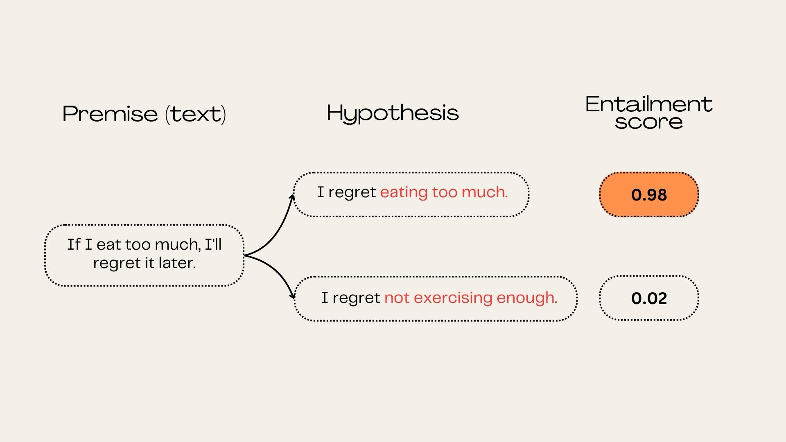

# Entailment Zero-Shot Text Classification
This repository contains the code to run entailment zero-shot text classification experiments.

Entailment, in the context of natural language processing (NLP), refers to a logical relationship between two sentences, where the truth of one sentence (the premise) logically necessitates the truth of another sentence (the hypothesis). In simpler terms, if the premise is true, then the hypothesis must also be true.


## Requirements 
To install the requirements run the following command: 
```
!pip install -r requirements.txt
```

If you want to run GloVe token masking, you need to install the ```glove.6B.300d.txt``` file from the following [link](https://www.kaggle.com/datasets/thanakomsn/glove6b300dtxt)

## Usage

Clone the repo using the following command:
```
git clone https://github.com/rayaneghilene/ARENAS_Automatic_Extremist_Analysis/tree/main/Entailment_framework.git
```

### Entailment Experiments

To run entailment experiments on your dataset, navigate to the folder containing the code and use the following bash command line:

```
python entailment_experiment.py \   
    --candidate_labels 'label1' 'label2' \ 
    --dataset_path 'PATH_TO_YOUR_DATASET' \
    --model_name \                    # ('roberta' or 'bart')
    --device \                        # Device specifier (0 or 1). 
    --progress_bar \                  # 'progress-bar-on' or 'progress-bar-off' (default)
    --hypothesis_template             # specify the hypothesis template

```

* You should specify the ```hypothesis_template```, it must include {} for the candidate label.
* Here's an example hypothesis template: 
```"This example is {}".```

* We recommend using the argument ```progress-bar-off``` for maximum efficienty (default option), you can use ```progress-bar-on```if you wish to visualize the progress of the execution.

* The ```--device``` argument allows you to choose between available GPUs. 

### Entailment Experiments (with GloVe masking)
Similarly to the Entailment ZSL experiment run the following command:

```
python GloVe_Masking.py \   
    --candidate_labels 'label1' 'label2' \ 
    --dataset_path 'PATH_TO_YOUR_DATASET' \
    --glove_embeddings_path 'PATH_TO_THE_GLOVE_EMBEDDINGS_FILE' \
    --model_name \                    # ('roberta' or 'bart')
    --device \                        # Device specifier (0 or 1). 
    --progress_bar \                  # 'progress-bar-on' or 'progress-bar-off' (default)
    --hypothesis_template             # specify the hypothesis template

```

## Dataset

Your dataset should include two columns ```text``` for the text and ```class``` for the labels/classes. If you want to get the unique labels in the dataset, run the following command line:

```
python get_dataset_labels.py \
    dataset_path \
```

## Contributing
We welcome contributions from the community to enhance work and further support natural language interference research. 
If you have ideas for features, improvements, or bug fixes, please submit a pull request or open an issue on GitHub.


## Support
For any questions, issues, or feedback, please reach out to rayane.ghilene@ensea.fr
